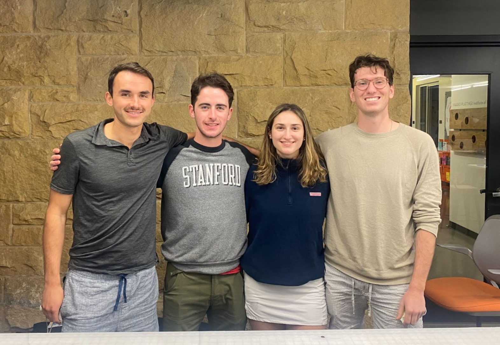
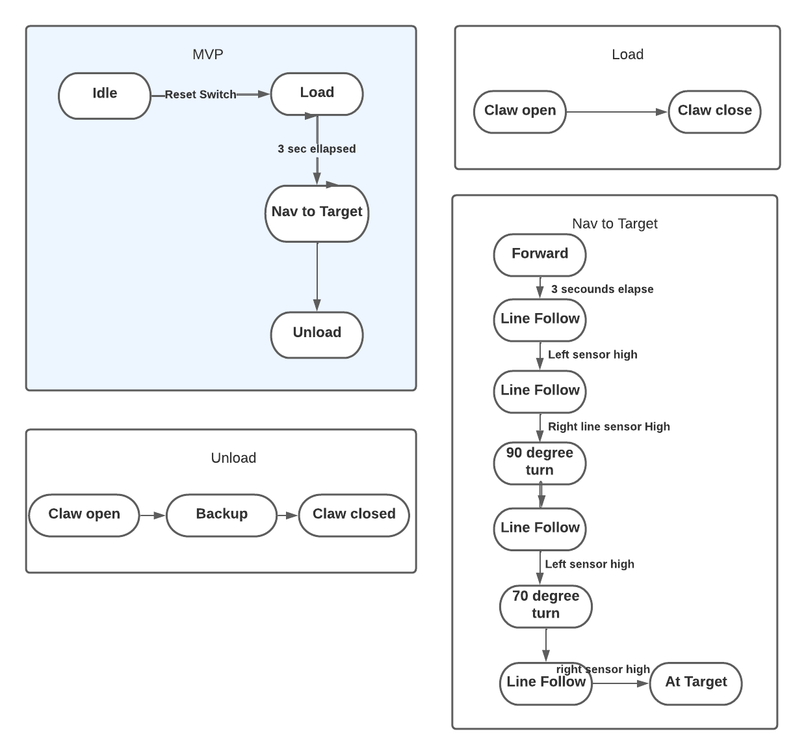
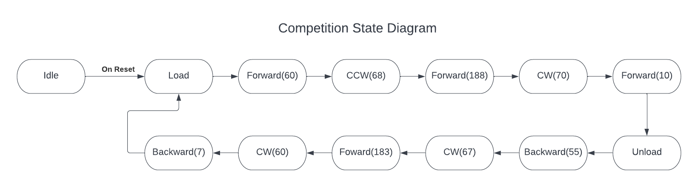
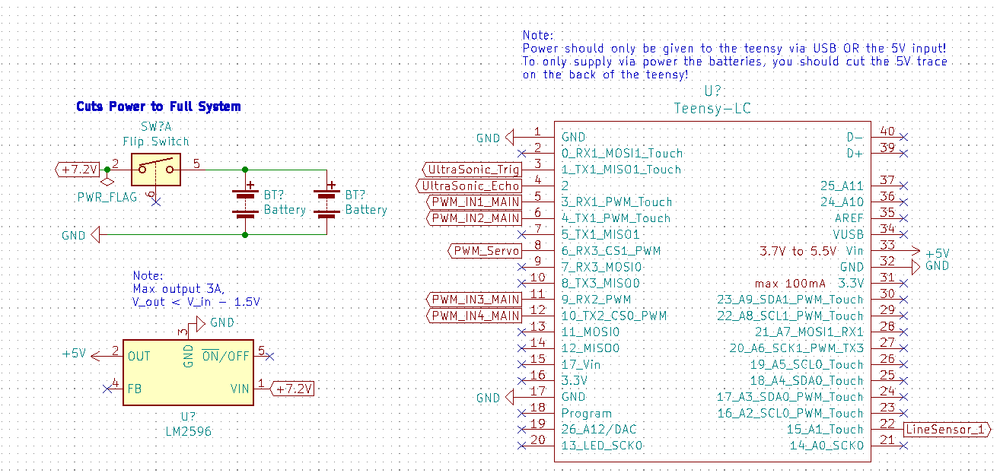
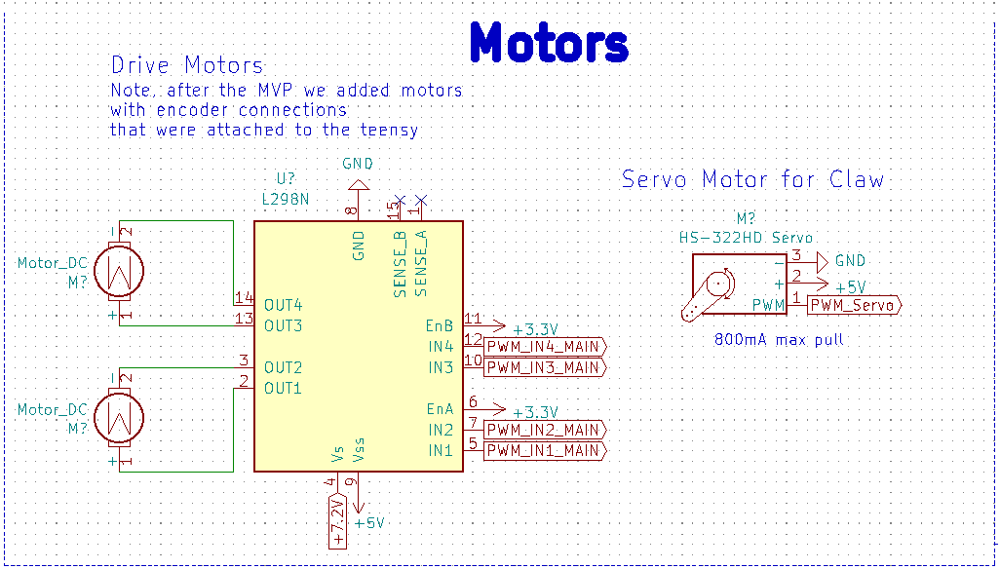
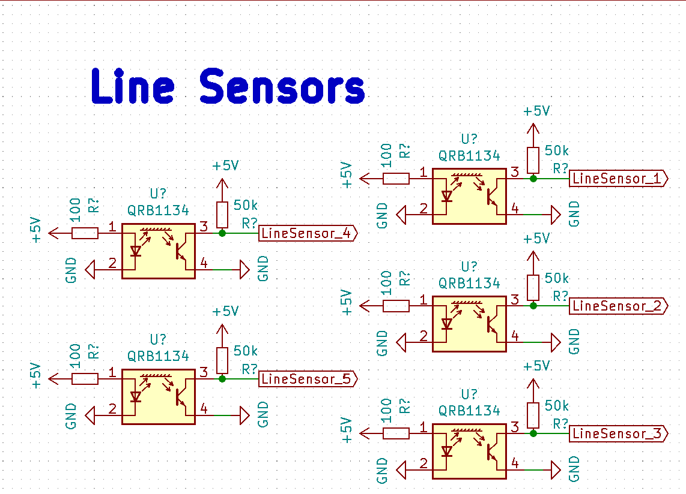
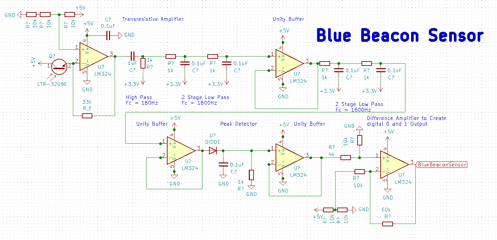
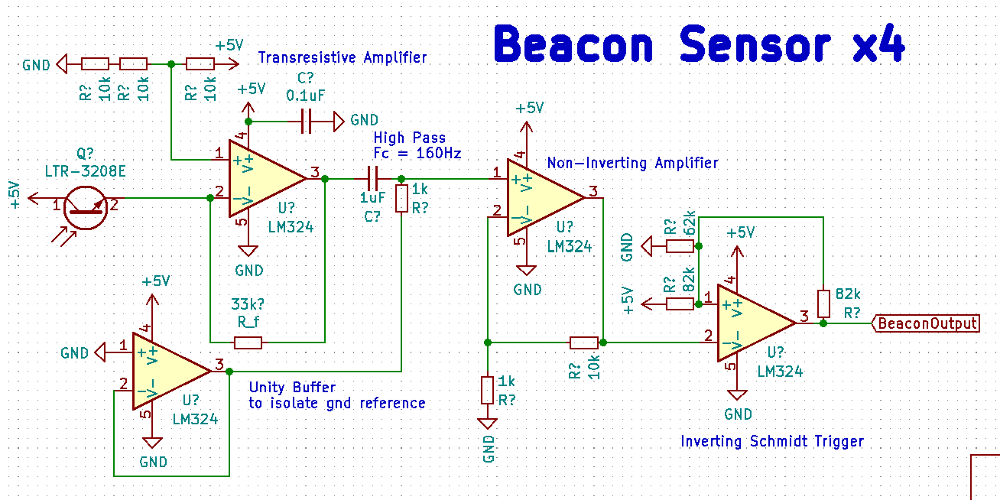

# 🐑 ME210 Final Project — Team Schleep 🐑
_No sheep may leave the flock_
## Meet the Team 🏆
*| Paxton: Engineering Physics | 23’
Flynn: Computer Science, 23’ |
D’Arcy: Engineering Physics 22’ |
Grant: Engineering Physics 23’ |*
## Meet the Robot 🤖

Our task was a simple one—design, build and test a robot for shepherding Stanford sheep (frosh) through their academic careers (from one side of a table to the other). The rules were simple: the robot must fit in a 12” cube. And a bunch of other rules, but details...
#### MVP/Beat the Brick 🧱
For our MVP robot, we used very slow motors, a 3D-printed claw, and a set of 5 IR sensors to navigate through the treacherous maze of Stanford academia.

Three sensors were placed in the center of the robot to sense deviations from the line (career path- CS of course), and two sensors were placed at the far edges of the robot in order to sense junctions and holes in the course. We divided the course up into zones to create a smaller state machine; each zone corresponded to a different ‘trip’ condition for our robot to look out for in order to execute the next turn.

The claw used a servo in order to open and close at the right points in our state machine. To set up this functionality, we had to calibrate the servo to understand what angle corresponded to an open and closed claw. The claw itself used a pair of 3D printed gears to translate the movement of the servo to opening and closing the claw with the right amount of force to trap our ‘sheep’ in their pen without decapitation.

We initially installed faster motors on our robot, however we quickly realized this made it very difficult for us to create reliable line following code. To combat this we switched out our motors for a much slower set without encoders that gave the robot enough time to react to deviations in the path (sophomore year crisis when they think they might do Symbolic Systems instead of CS).

#### State Machine
##### MVP


##### Competition Robot


## MVP Subsystem Overviews

### Mechanical

CAD is available [in Fusion 360 format](./CAD/Assembly.f3z) and as a [STEP file](./CAD/Assembly.step). These may be used to modify the design or generate STLs for printing and DXFs for laser cutting. View the CAD online in 3D [here](https://a360.co/3q2kXgB)

##### Chassis

Our chassis design went through three iterations. The first iteration was very simple. It consisted of a rectangle with attachment points for the wheels and claw. By the second iteration, we added more space for electronics which we were taping on originally. We also added a  mechanism for attaching line sensors to the bottom of the chassis. The second iteration also had a second layer that connected to the first layer with laser cut standoffs. While the second iteration began looking like a robot, it was relatively messy mechanically. The laser cut standoffs introduced significant play into the design and the sensors on the bottom (which were also a friction fit of laser cut pieces) kept on falling out. Additionally our electronics were still mostly mounted on a breadboard that was taped to the second layer. Debugging became very challenging as our design increased in complexity. We designed our third iteration to address many of the pain points introduced by the second. We started using 3D printed standoffs with bolts in order to create a more secure attachment between the different layers. Similarly, we moved over to entirely 3D printed sensor mounts that were also attached to the chassis with bolts. In addition to the more secure attachment points, we added attachment points for the motor driver and bread board to create a more clean design and simplify debugging. We finally added a spot for the power switch and holes to pass the wires through.


##### Claw

While brainstorming for a ball mechanism, we wanted to design something that was simple but also general enough to handle the large megasheep and the action of lifting. The mechanism we came up with was a claw actuated by a single servo with interlocking gears to make both sides of the claw move in tandem. We printed out two iterations of the claw in order to fine tune the shape and mechanism. For the second iteration, we made the claw slightly more compact in the forward-backward direction, increased the slope inside the claw to guarantee that the balls would roll out when it opened, and created a more stable mechanism for attaching the servo to the gear.


##### Crane

We designed a very large mechanism for moving the claw 12” up to a basket for double points. To achieve this, we decided to mount the claw on linear bearings and lift it with a stepper motor paired and a timing belt similar to how many 3D printers work. The official rules stated “your robot may be dismembered to conform to this specification”—this was a point of contention among many of the contenders. We interpreted this as “your robot may have some of its members detach during the weigh-in (fitting)”. The referees ruled that this interpretation was fraught, so we descoped this subsystem. Do datasheets have jokes in them? That would be funny.


#### Electrical ⚡
##### Power
We chose to use a baseline of +7.2V to power the robot with two batteries in parallel instead of +14.4V in series due to the input ratings of our voltage converter. We actually only used one battery the entire time and simply recharged it to keep the structure smaller and wiring simpler, but if we had a few more days to implement our other systems, we would have used two in parallel to keep the system operating voltage more consistent. The only MVP system directly connected to 7.2V is the main motor driver, all other systems use voltage from our two voltage converters.

*Note: ignore Teensy data connections, this is just to demonstrate our power systems*

We used the LM2596 to create a +5V output to power the Teensy LC with the back USB trace cut so that we ensured consistent ground and power sources (avoiding computer power supply) and only used the USB input for TX/RX. We used the Teensy incorporated 3.3V converter to create a 3.3V power line. We were very careful to not over draw current from these two power converters, and if we were to implement our elevator design, we would have added a second LM2596 converter to remain within the 3A maximum rating.

#### Motors
We initially began our MVP design with larger drive motors (Gear Motor w/Encoder, model No.GB37Y3530-12V-251R) with embedded encoders, but these motors were too fast for our three central line sensors to maintain stable line following, so we changed to smaller motors without encoders for our checkoff where we used a line following method. Abandoning line sensing after our checkoff for more exciting navigation techniques, we changed our motors again for the encoder motors for increased torque and speed. Our two chassis motors are driven by the L298N motor driver in an H-Bridge configuration with PWM control from the Teensy.

*Note: Doesn't include non-MVP stepper motor and associated voltage converter*

The collection claws are driven by a small HS-322HD servo motor, which we could easily write to open and close and specific angles. The motor provided far enough torque to close the claw. One challenge was that we had to change the given “close” and “open” angles each time we rebuilt the claw due to the servo motor’s reference angle changing.

We had one final stepper motor (not included on the schematic) that ran our elevator up and down to exact heights. This stepper design was almost identical to that of Lab 2, but we had inconsistent behavior because our draw voltage of 7.2V was a bit too low for the stepper. We added a voltage converter to increase the input voltage, which fixed inconsistencies with the stepper.

#### Line/Hole Sensors
We used the IR reflection sensors available in the lab (QRB1134) to implement a line following system. Testing the lab conditions and the height of our chassis, we finalized on an emitter load resistor of 100 ohms and a collector load resistor of 50k ohms. This allowed us to differentiate black tape from white floor and was sensitive enough to differentiate hole from black tape for hole detection.



#### Beacon Sensors (De-Scoped)
The last two weeks of the project after we were confident in our MVP, our team changed from a line following strategy to a beacon sensing approach while we developed the elevator system to deliver balls to the upper basket. We found several challenges in the beacon sensing and only got the sensors to work reliably two days before the competition once it was too late to fully implement the technology. However, we built and successfully tested four of the beacon sensors and developed simple code that read the modified signal to determine the frequency and therefore the beacon “color”. All beacon sensor designs used the LTR-3208E phototransistor attached to a transresistive amplifier that linearized the output signal from the LTR. We also noticed a pervasive low frequency signal that was easily filtered out on both designs by a single passive RC high pass filter with Fc = 160 Hz.

Our first approach to beacon sensing that we ultimately abandoned due to the complexity of the circuit was a selective filtering approach that filtered out one of the beacons and only returned a binary high/low voltage depending if the other beacon was in sight. We fully built out a model for the 910 Hz signal and successfully tested it, but the amount of components required for the circuit and the need to build one for red and one for blue led us to choose a different beacon sensing option. However, this complex circuit was a really fun challenge.

*First beacon sensor design*


After the transresistive amplifier and high pass filter, we added two 2-stage low pass filters separated by a unity buffer to eliminate the 3333 Hz red signal. The 3333 Hz signal was far stronger than the 910 Hz signal for some reason, so we had to use two steep cutoffs to dampen the signal well. Additionally, we had the RC filters pull the signal average to 3.3V to be within the operating range of the opamp which would otherwise clip the signal at 0V. After the second 2-stage filter, we added another unity buffer and then a peak detector circuit that would keep only the high signal of about 3.5V when pointed at 910 Hz compared to 3V without signal. I had to add a load resistor to the peak detector connected to ground to solve capacitance loading issues after adding another unity buffer after the peak detector. Finally, to turn the 3V no-signal, 3.5 V signal output to 0 V no-signal, 3.3 V signal, I added a difference amplifier circuit to return the final signal as a digital 1 or 0 output voltage. One change I would add to this circuit is adding another unity buffer to the references of the RC passive filters. Here’s the final product:

*Final beacon sensor design*

The circuit we actually ended up using simply returned a filtered, amplified signal of the raw frequency output, which we could connect to the teensy to determine if the input signal is 3333 Hz or 910 Hz. for this circuit the aim was to make the entire circuit use only one four stage opamp package. This circuit uses a unity buffer attached to ground as a reference to the high pass filter. Then the signal is fed into a simple non-inverting amplifier and finally into an inverting schmitt trigger that adds correcting hysteresis to smooth out the output frequency. This circuit outputted beautiful signals that accurately provided pointing data, but it again suffered from the fact that the 3333 Hz signal was far brighter and would interfere with the 910 Hz signal. We also noticed that the white board reflected the signals a bit which led to messy measurements if the phototransistor was pointed too close to the ground.

#### Ultrasonic Sensors (De-Scoped)
Although we didn’t use them for the MVP or contest, we had planned on using the lab provided HC-SR04 ultrasonic sensors to determine distance to a wall and for the elevator to determine if it was in front of the upper basket. We got the sensors reading out distance but did not incorporate them into our abstracted code. Find the basic schematic on our github.

#### Implementation
We used only breadboards for all electronics, which actually worked great and allowed us to modify circuits along the way. To simplify the wiring, we heat shrinked longer wires. See our final wiring here with the beacon sensors attached at the side.

*We would have heat shrunk the longer wiring here used for the beacon sensors, but we abandoned these the night before the competition to simply use motor encoders*

#### Software 💻

##### Abstraction

To make our code modular and abstract out lower level functionality, we implemented a multple levels of abstraction. The highest level was the '''system.h''' class which included instantiation of a Chassis class (to handle robot wheel actuation), a Claw class, and Sensors struct with all of our sensors.

```

struct System
{
public:
  struct Sensors
  {
    struct LineSensors
    {
      LineSensor left = LineSensor(LINE_LEFT);
      LineSensor center_middle = LineSensor(LINE_CENTER_MIDDLE);
      LineSensor center_left = LineSensor(LINE_CENTER_LEFT);
      LineSensor center_right = LineSensor(LINE_CENTER_RIGHT);
      LineSensor right = LineSensor(LINE_RIGHT);
    };
    LineSensors line;

    struct UltrasonicSensors
    {
      UltrasonicSensor front = UltrasonicSensor(15);
      UltrasonicSensor periscope = UltrasonicSensor(15);
    };
    UltrasonicSensors ultra;
  };
  Sensors sensors;
  Chassis chassis = Chassis(RIGHT_FORWARD_PIN,
                            RIGHT_BACKWARD_PIN,
                            LEFT_FORWARD_PIN,
                            LEFT_BACKWARD_PIN,
                            ENCODER_RIGHT_PIN1,
                            ENCODER_RIGHT_PIN2,
                            ENCODER_LEFT_PIN1,
                            ENCODER_LEFT_PIN2,
                            HUB_TO_HUB_DISTANCE,
                            WHEEL_CIRCUMFERENCE,
                            MOTOR_MIN_SPEED);
  Claw claw = Claw(SERVO_PIN, OPEN_CLAW_ANGLE, CLOSE_CLAW_ANGLE);

  void activity(void);
};

extern struct System shephard;
```

The Chassis class held instantiation of a Motor class or an EncoderMotor class which is a subclass of Motor with added functionality to handle checking the hall sensors used by the encoder. Within the Sensors struct, we instantiate all of our sensor classes which each provided simple interfaces to get data from the sensors. For instance, within the linesensor class we have the function

```
int LineSensor::read()
{
  int value = 0;
  for (int i = 0; i < 10; i++)
  {
    value += analogRead(pin);
  }
  value /= 10;

  if(value <= lineThreshold){
    return 0;
  }
  else{
    return 1;
  }
}
```

which uses a simple sensor averaging technique to reliably return a binary response indicating weather the sensor is over black tape or not.

##### State Machine Implementation

To handle the state machine implementation, we used a similar model to the state machine from the first lab.

```
  switch(state) {
    case STATE_IDLE:
      shephard.chassis.stop();
      break;
    case STATE_LOAD:
      handleLoadState();
      break;
    case STATE_NAV_TARGET:
      handleNavTargetState();
      break;
    case STATE_UNLOAD:
      handleUnloadState();
      break;
    case STATE_NAV_LOAD:
      handleNavLoadState();
      break;
    default:
      Serial.println("What is this I do not even...");
  }
  ```

  In essence, we used a state variable and switch statement to call different handlers depending on which state we were in.


## De-Scoped Subsystems

#### Beacon Sensing
We implemented some fancy circuits for detecting an IR beacon for navigation through the wild offroad (off-the-black-line) regions of the game arena. We ultimately decided not to include these in the final robot because of large variations in the beacons in the arena, which made reproducible performance difficult.

## Competition Robot
Mere days before the competition, after a 1am caffeine fueled work session, various members of our team came to the depressing realization that neither the crane nor the beacon sensors were going to work in time for the Final Competition. Consequently we returned to our MVP, and brainstormed different ways to make our beautiful robot ready for the real world. This took the form of returning to the faster motors, but this time we decided to make full use of the encoders. As our encoders were relatively accurate, we were able to zoom across the obstacle course, ignoring the lines and the holes, taking 22 units every quarter to place our Stanford sheep in their pen (Facebook/ Microsoft/ Google internships). We tried to use the encoders to return our robot to their starting position, however this movement was much less accurate due to the variability of the board, the robot starting position and how the robot turned. If we had more time (like 3 more hours) we would have combined our line sensing with the encoders in order to ensure that our robot returned to the exact same position each time.

## Lessons Learned
While our team started off strong, we hit a number of issues along the way that impeded our progress and might have been avoided. 

We were quickly able to identify an MVP and define how we wanted to meet all of our different priorities for the "beat-the-brick" version of our robot. Consequently, we were able to reach our check off point relatively quickly as we all worked efficiently and cohesively to meet this goal. However after this point we failed to have another proper strategy meeting where we decided exactly what our priorities were for our final competition robot. Between our check off point and the competition we all worked on different aspects of the design that eventually failed to come together, forcing us to revert to just using encoders and the claw to score points during the competition. Reflecting on this experience it is clear that one of two strategy meetings with the entire team present would have been enough to streamline our goals and ensure our work was cohesive enough to deliver a final competition-ready robot that utilized a choice set of subsystems. 

Practically, we also learnt that 3D printing components can be much more flexible and efficient as this mode allows geometries that have 90 degree angles (such as custom brackets), as well as other custom geographies. We also learnt the importance of reading the design specifications very carefully, as this unfortunately limited our design very late in the competition.


# TODO
- in electronics add name of smaller motors if we can find them
